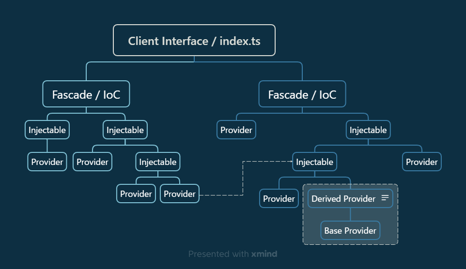

# User Service (doc for dev)

```cli
node^18.15.0
```

觀看 Markdown 文件可使用 vs code 的擴充套件「Markdown Preview Enhanced」。

## 功能需求

### Parameter Builder

封裝 API 所需參數，提供統一的參數介面發送 API 請求，其中參數包括：

- 路徑參數 - `example-api-endpoint/:id/:sid`
- 查詢參數 - `example-api-endpoint?name=<NAME>&age=<AGE>`
- 請求體 (Request Body)

假設今天有一接口 `POST baseURL/example-api-endpoint/:id/:sid?name=<NAME>&age=<AGE>`，而 req body 另需 `hobby`、`address` 兩個欄位，且 Content-Type 為 multipart/form-data，在以往使用 fetch、axios 等方法中，需要繁雜的程式碼才能順利發送請求。

透過 API 封裝，可將後續請求時的代價降到最低，例如上述的 API 範例，在使用封裝完後所返回的方法，只需要透過以下的程式碼就能發送請求：

```js
globl.$service.exampleApi({
    id: 123,
    sid: 456,
    name: "切版大阿莫濕",
    age: 23,
    hobby: "研究 CSS",
    address: "地球某個地方"
})
```

其中省略了包括像 request url 的組成、FormData 的建立、HTTP 方法的設置...等等。

### Request Handler

處理實際的 HTTP 請求，包括設置請求頭、選擇正確的 HTTP 方法，處理 formdata 等。

目前規劃使用最原始的 `XMLHttpRequest` 進行封裝。

### Cache Manager

管理 API 請求的資料暫存，以減少不必要的請求。可以使用簡單的快取機制，檢測到相同的請求時直接返回暫存值。

### Validation Engine

負責處理參數驗證規則，包括測量長度、大小、自定義型別等。提供生命週期中的驗證過程，以便開發人員設置 side effect、防呆機制等。

目前規劃三種驗證機制：

1. Rule Literal：此套件內置的規則語法，會根據給訂條件自動生成驗證函數
2. RegExp：正規表達式
3. validatorFuntion：自定義驗證規則函數

以字串構成的驗證規則(Rule Literal)，概念大致如下：

1. 先指定基本型別，例如 string、int、number、boolean、file...等等。
2. 若型別本身或其屬性可數，則可以加上後綴 `@`，指定其最大最小或相等值，range 設置使用 `:` 符號，若無 range 符號則認定其值為相等值。
3. 若該參數為陣列，可在型別之後加上 `[]` 指定其為陣列，且方括號內亦可設置陣列長度限制。

以下為語法範例：

- `int` - 整數
- `string@10` - 長度為 10 的字串
- `number@0:` - >= 0 的數字
- `boolean@0:1` - 錯誤，boolean 不可數
- `file@15kb:5mb` - 型別為 File 物件，且 size >= 15kb 和 <= 5mb
- `string@10` - 長度 === 10 的字串
- `int[]` - 整數陣列
- `string[5]` - 長度 === 5 的字串陣列
- `number@0:[3:]` - 長度 >= 3 的數字陣列，且數字必須 >= 0

其他規則以此類推...

### Documentation Generator

生成 API 文件的模組，動態收集端點、參數說明、驗證規則等資訊，生成可閱讀的 API 文件。

## 程式結構



此圖僅為結構示意，並不代表實際功能拆分狀況。

### 角色功能簡介

- **Client Interface / index.ts**：彙整單/多個 IoC 容器，提供最終使用者介面，也是引入套件的地方。
- **Fascade / IoC**：表象模式/控制反轉容器，彙整單/多個功能模組，提供一個完整功能。
- **Injectable**：有依賴注入的功能模組。
- **Base / Derived Provider**：無依賴注入的類別，提供最純粹的功能，為整個程式架構最基礎單位，base / derived 為 provider 的繼承關係。

> **[提醒]** 功能在進行切割、拆分時須注意彼此是否有**循環依賴**（A 依賴於 B、B 依賴於 C、C 依賴於 A）。如果有，請考慮其他拆分方式，避免在 IoC 建立依賴實例時出現錯誤。
