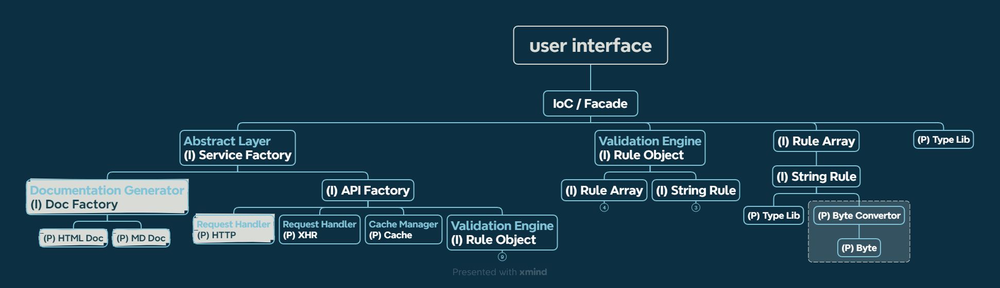

# User Service (doc for dev)

觀看 Markdown 文件可使用 vs code 的擴充套件「Markdown Preview Enhanced」。

- [Linting](./docs/linting.md)

本專案使用 node 環境：

```text
node^18.15.0
```

開發使用指令：

```bash
npm run dev
```

目前僅用 live server 去 run `<root-dir>/example` 去檢視 dist 的 esm 版本。

## 程式結構



> 淺色底為規劃中、尚未實作的項目。

### 角色功能簡介

- **user interface / index.ts**：彙整單/多個 IoC 容器，提供最終使用者介面，也是引入套件的地方。
- **IoC / Fascade**：控制反轉容器/表象模式，彙整單/多個功能模組，提供一個完整功能。
- **(I) Injectable**：有依賴注入的功能模組。
- **(P) Provider**：無依賴注入的功能模組，提供最純粹的功能，為整個程式架構最基礎單位。

> **[提醒]** 功能在進行切割、拆分時須注意彼此是否有**循環依賴**（A 依賴於 B、B 依賴於 C、C 依賴於 A）。如果有，請考慮其他拆分方式，避免在 IoC 建立依賴實例時出現錯誤。
