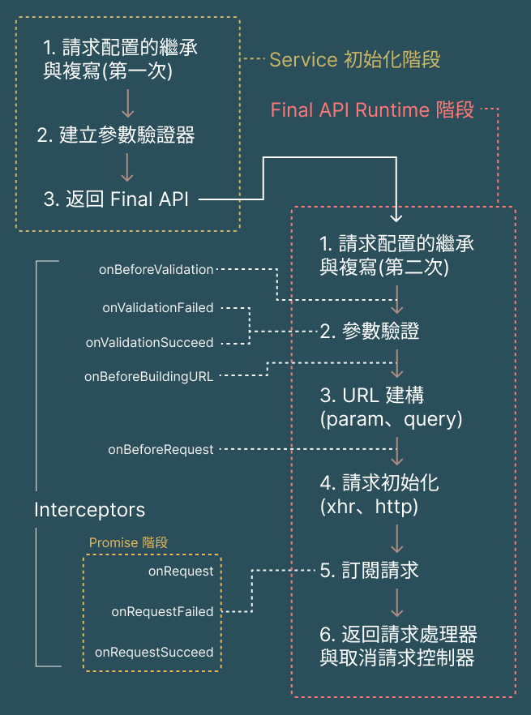

# 請求處理器

## APIFactory

`APIFactory` 是負責揉合 Validation Engine、Request Handler、與其他依賴，**最終產出 client 實際會使用到的 API (此後稱其為 Final API)** 的工廠。

### 流程

`APIFactory` 只有一個 public method，用於接收 API 配置後產出相應 Final API，而整個運作流程分為三個階段：

1. Service 初始化階段：此階段會在 `createService()` 時同步執行，將基本的配置寫入記憶體
2. Final API Runtime 階段：此階段會在 client 使用 Final API 時執行，為同步方法
3. Promise 階段：此階段會在 client 使用 Final API 所返回的 `requestHandler` 時執行，三個攔截器剛好會對應到 Promise 的三種狀態 pending、rejected、fulfilled

## 請求策略

`APIFactory` 預計會使用兩種請求策略，分別適用於不同環境：

- Browser：`XMLHttpRequest` => XHR.provider.ts
- NodeJS：`http` => HTTP.provider.ts

兩種策略皆需要實踐 `RequestHandler` 抽象類，亦可稱為 Concrete RequestHandler，`APIFactory` 在初始化時會依照環境選擇策略。

### RequestHandler

此抽象類僅定義了一個抽象方法 `RequestHandler.request()`，是 `APIFactory` 進行請求配置時所依賴的方法，此外，`Concrete RequestHandler` 內部其他成員不另做限制。

`RequestHandler.request()` 會要求請求時所需的基本參數，並返回四個屬性：

- `RequestDetail.requestToken`：該請求的 token，以 `<method><url>` 的格式字串所產生的 symbol，將用於快取管理 or 未來其他擴充項目，作為代表請求的鍵值
- `RequestDetail.request`：實際送出請求，並返回 Promise 的方法
- `RequestDetail.abortController`：取消請求的同步方法
- `RequestDetail.config`：請求配置

`RequestHandler.request()` 方法被執行時，僅會對該次請求寫入配置，**並不會立即送出請求**，後續在 `APIFactory` 使用其他實現 `RequestObserver` 的依賴，對 `RequestDetail.request` 執行訂閱動作。

另外，在 concrete RequestHandler 內進行 exception handling 時，須注意要捕捉 Promise 內所拋出的錯誤(通常是調用 `reject()` 時出現)，並在 catch 內將程式控制權向上轉移。
