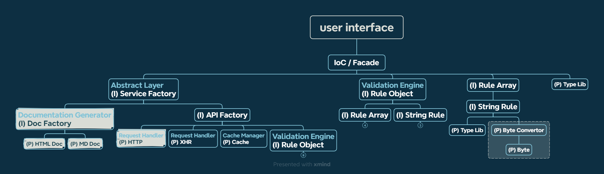

# User Service (doc for dev)

> 觀看 Markdown 文件可使用 vs code 的擴充套件「Markdown Preview Enhanced」。

- [Linting](./docs/linting.md)

本專案使用 node 環境：

```text
node^20.9.0
```

開發使用指令：

```bash
# dev
npm ci
npm run dev

# browser demo (HMR supported)
npm run dev:browser

# TODO: add demo script
```

## 套件 demo 演示 - Browser with vanilla js and ES Module

目前有兩個方案來查看 Browser demo：

1. 使用 VS Code extension「Live Server」瀏覽 <localhost:port/example/browser>
2. 使用 script `npm run dev:browser`

開發時會使用兩個 terminal 分別運行 `npm run dev` 及 `npm run dev:browser` 兩個指令。

## Request Handler

> 請參考 [Request Handler](./docs//request-handler.md) 文件

處理實際的 HTTP 請求，包括設置請求頭、HTTP 方法等。

目前規劃兩個策略，於不同環境執行：

1. XHR(原型已完成)：使用最原始的 `XMLHttpRequest` 進行封裝，適用於瀏覽器環境。
2. HTTP：使用 node 環境的 http 模組進行封裝，適用於 node 環境。

**策略必為抽象類 `RequestHandler` 的實現**，後續服務層在引用策略時才能依賴於抽象。

## Cache Manager

管理 API 請求的資料暫存，以減少不必要的請求。可以使用簡單的快取機制，檢測到相同的請求時直接返回暫存值。

### Validation Engine

負責處理參數驗證規則，包括測量長度、大小、自定義型別等。提供生命週期中的驗證過程，以便開發人員設置 side effect、防呆機制等。

目前規劃三種驗證機制：

1. Rule Literal：此套件內置的規則語法，會根據給訂條件自動生成驗證函數
2. RegExp：正規表達式
3. validatorFunction：自定義驗證規則函數

以字串構成的驗證規則(Rule Literal)，概念大致如下：

1. 先指定基本型別，例如 string、int、number、boolean、file...等等。
2. 若型別本身或其屬性可數，則可以加上後綴 `@`，指定其最大最小或相等值，range 設置使用 `:` 符號，若無 range 符號則認定其值為相等值。
3. 若該參數為陣列，可在型別之後加上 `[]` 指定其為陣列，且方括號內亦可設置陣列長度限制。

以下為語法範例：

- `int` - 整數
- `string@10` - 長度為 10 的字串
- `number@0:` - >= 0 的數字
- `boolean@0:1` - 錯誤，boolean 不可數
- `file@15kb:5mb` - 型別為 File 物件，且 size >= 15kb 和 <= 5mb
- `string@10` - 長度 === 10 的字串
- `int[]` - 整數陣列
- `string[5]` - 長度 === 5 的字串陣列
- `number@0:[3:]` - 長度 >= 3 的數字陣列，且數字必須 >= 0

其他規則以此類推...

### Documentation Generator

生成 API 文件的模組，動態收集端點、參數說明、驗證規則等資訊，生成可閱讀的 API 文件。

## 程式結構



> 淺色底為規劃中、尚未實作的項目。

### 角色功能簡介

- **user interface / index.ts**：彙整單/多個 IoC 容器，提供最終使用者介面，也是引入套件的地方。
- **IoC / Facade**：控制反轉容器/表象模式，彙整單/多個功能模組，提供一個完整功能。
- **(I) Injectable**：有依賴注入的功能模組。
- **(P) Provider**：無依賴注入的功能模組，提供最純粹的功能，為整個程式架構最基礎單位。

> **[提醒]** 功能在進行切割、拆分時須注意彼此是否有**循環依賴**（A 依賴於 B、B 依賴於 C、C 依賴於 A）。如果有，請考慮其他拆分方式，避免在 IoC 建立依賴實例時出現錯誤。
