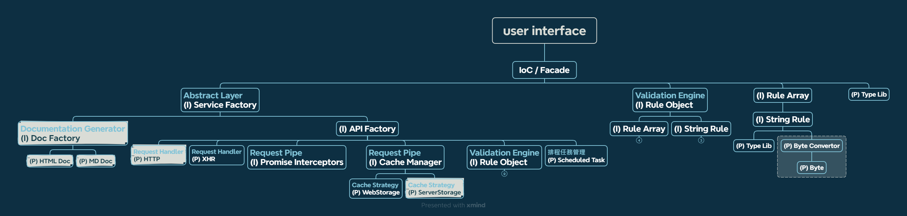

# User Service (doc for dev)

> 觀看 Markdown 文件可使用 vs code 的擴充套件「Markdown Preview Enhanced」。

- [Linting](./docs/linting.md)

本專案使用 node 環境：

```text
node^20.9.0
```

## 指令

```bash
# 安裝依賴
npm ci

# 開發模式：監看 src 變動重新打包進 dist
npm run dev

# 開發模式(browser)：監看 src、example/browser 變動，重新打包進 dist 並 reload 網頁，`<port>` 預設是 5678
npm run dev:browser <port>

# 測試
npm run test

# 檢查原始碼格式
npm run lint

# 快速修正原始碼格式
npm run lint:fix

# 自動排版
npm run format

# 打包
npm run build
```

## 目錄

```text
|- root
   |- .husky            # git precommit hooks 設定
   |- docs              # 所有文件
   |  |- dev-docs       # 開發文件
   |- example           # 套件成品使用 demo
   |  |- browser        # vanilla js with es module
   |- scripts           # npm 腳本
   |- src               # 原始碼
   |  |- abstract       # 抽象類
   |  |- assets         # 靜態資源 or 常數
   |  |- core           # 程式主要功能
   |  |- decorator      # 裝飾器
   |  |- types          # 類型聲明 (type, interface)
   |  |- utils          # 共用邏輯
   |- test              # 測試
```

## 程式結構



本專案主要架構以 **控制反轉（Inversion of Control, IoC）** 與 **依賴注入（Dependency Injection）** 實現功能模組間的串接，此架構有助於提高代碼的可維護性、可測試性和可擴展性，透過使用控制反轉和依賴注入，可以更容易地管理模組之間的關係，使系統更加靈活且易於理解。

由控制反轉容器所扮演的表象模式則提供了一個簡潔的外部介面，隱藏了內部細節，使得整體系統的複雜性被隔離在特定的組件之中。

1. **User Interface / index.ts**：
    - 定位： 這是使用者介面的入口點，也是引入整個套件的地方。
    - 職責： 彙整單一或多個控制反轉容器（IoC Container），提供最終的使用者介面。
    - 解釋： 在這個檔案中，你可以期望看到程式初始化的相關邏輯，包括建立並配置控制反轉容器，以及引入其他功能模組。
2. **IoC / Facade**：
    - 定位： 控制反轉容器或表象模式的實現。
    - 職責： 彙整單一或多個功能模組，提供一個統一的、簡化的接口，為整個系統提供完整功能。
    - 解釋： 這可能是一個具有高層次介面的類別或模組，它擔當了整體系統的門面，隱藏了底層功能模組的複雜性，讓其他部分能夠更容易地與系統進行互動。
3. **(I) Injectable**：
    - 定位： 有依賴注入的功能模組。
    - 職責： 提供特定的功能，同時明確聲明其所依賴的其他模組，以便透過依賴注入方式進行配置。
    - 解釋： 這些功能模組通常包含了業務邏輯，但它們的依賴性被移除，而是透過外部容器進行注入。這樣的結構有助於提高程式碼的可測試性和可擴展性。
4. **(P) Provider**：
    - 定位： 無依賴注入的功能模組，提供最純粹的功能。
    - 職責： 為整個程式架構提供最基礎的功能，通常不涉及依賴注入。
    - 解釋： 這些功能模組可能是一些提供低層次服務或基本功能的元件，它們不依賴於外部組件，而是直接提供服務。這有助於確保最基礎的功能的獨立性和穩定性。

> **[提醒]** 功能在進行切割、拆分時須注意彼此是否有**循環依賴**（A 依賴於 B、B 依賴於 C、C 依賴於 A）。如果有，請考慮其他拆分方式，避免在 IoC 建立依賴實例時出現錯誤。

## 功能模組

### Request Handler

> 請參考 [Request Handler](./docs/request-handler.md) 文件

處理實際的 HTTP 請求，包括設置請求頭、HTTP 方法等。

目前規劃兩個策略，於不同環境執行：

1. XHR(原型已完成)：使用最原始的 `XMLHttpRequest` 進行封裝，適用於瀏覽器環境。
2. HTTP：使用 node 環境的 http 模組進行封裝，適用於 node 環境。

**策略必為抽象類 `RequestHandler` 的實現**，後續服務層在引用策略時才能依賴於抽象。

#### Request Pipe

##### Promise Interceptors

請求時 Promise 階段的攔截器。

##### Cache Manager

管理 API 請求的資料暫存，以減少不必要的請求。可以使用簡單的快取機制，檢測到相同的請求時直接返回暫存值。

### Validation Engine

負責處理參數驗證規則，包括測量長度、大小、自定義型別等。提供生命週期中的驗證過程，以便開發人員設置 side effect、防呆機制等。

目前規劃三種驗證機制：

1. Rule Literal：此套件內置的規則語法，會根據給訂條件自動生成驗證函數
2. RegExp：正規表達式
3. validatorFunction：自定義驗證規則函數

以字串構成的驗證規則(Rule Literal)，概念大致如下：

1. 先指定基本型別，例如 string、int、number、boolean、file...等等。
2. 若型別本身或其屬性可數，則可以加上後綴 `@`，指定其最大最小或相等值，range 設置使用 `:` 符號，若無 range 符號則認定其值為相等值。
3. 若該參數為陣列，可在型別之後加上 `[]` 指定其為陣列，且方括號內亦可設置陣列長度限制。

以下為語法範例：

- `int` - 整數
- `string@10` - 長度為 10 的字串
- `number@0:` - >= 0 的數字
- `boolean@0:1` - 錯誤，boolean 不可數
- `file@15kb:5mb` - 型別為 File 物件，且 size >= 15kb 和 <= 5mb
- `string@10` - 長度 === 10 的字串
- `int[]` - 整數陣列
- `string[5]` - 長度 === 5 的字串陣列
- `number@0:[3:]` - 長度 >= 3 的數字陣列，且數字必須 >= 0

其他規則以此類推...

### Documentation Generator

生成 API 文件的模組，動態收集端點、參數說明、驗證規則等資訊，生成可閱讀的 API 文件。
